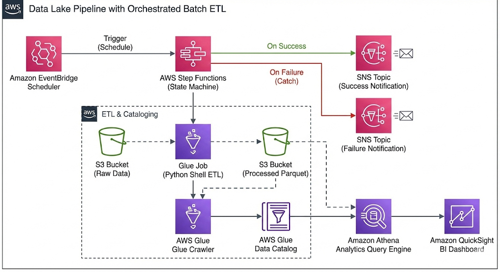
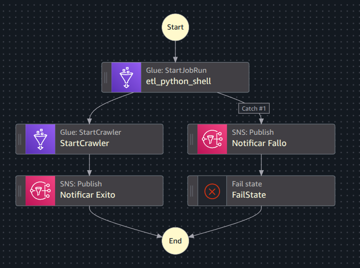

# Pipeline de Datalake con ETL orquestado por lotes en AWS

Este proyecto implementa un pipeline de datos automatizado (ETL) que simula la carga masiva y periódica de datos empresariales. Orquesta la ingesta, transformación, catalogación y notificación de datos utilizando servicios nativos de AWS.

## 🏛️ Arquitectura

El flujo de trabajo es orquestado totalmente por **AWS Step Functions** y sigue estos pasos:

1. **Ingesta:** Los datos crudos (CSV) se almacenan en S3.
2. **Trigger:** **EventBridge Scheduler** activa el pipeline automáticamente (simulación batch/nocturna).
3. **Procesamiento (ETL):** **AWS Glue** (Python Shell) limpia los datos y los convierte a formato **Parquet**.
4. **Catalogación:** Un **Glue Crawler** actualiza el Data Catalog automáticamente.
5. **Calidad y Alertas:** Manejo de errores con **SNS** (envío de correos en caso de Éxito o Fallo).
6. **Analítica:** Consultas SQL con **Athena** y visualización en **QuickSight**.

## 🛠️ Servicios AWS utilizados

* **Orquestación:** AWS Step Functions (Workflow Studio).
* **ETL:** AWS Glue (Jobs & Crawlers).
* **Almacenamiento:** Amazon S3 (Raw & Processed zones).
* **Consultas:** Amazon Athena.
* **Visualización:** Amazon QuickSight (Quick Suite).
* **Automatización:** Amazon EventBridge Scheduler.
* **Notificaciones:** Amazon SNS.

## 📂 Estructura del repositorio

* `/src`: Contiene el script de transformación en Python (PySpark/Python Shell).
* `/orchestration`: Definición JSON (ASL) de la State Machine.
* `/sql`: Consultas de validación y análisis usadas en Athena.

## 🚀 Cómo desplegar

1. **S3:** Crear bucket con carpetas `raw/`, `processed/` y `scripts/`.
2. **IAM:** Configurar roles con permisos para Glue, Step Functions y EventBridge.
3. **Glue:** Crear el Job copiando el script de `/src`.
4. **Step Functions:** Importar el código de `/orchestration` en una nueva máquina de estado.
5. **EventBridge:** Configurar la regla cron para el disparo automático.

## 📊 Resultados

### Ejecución Orquestador (Step Functions)

### Dashboard de Negocio (QuickSight)

# 📍 Alcance del Proyecto y Suposiciones de Ingesta

Este proyecto se enfoca en el ciclo de vida del dato post-ingesta (Procesamiento, Orquestación y Consumo).

Simulación de la Fuente de Datos: Se asume la existencia de un sistema transaccional externo (ej. un ERP de Ventas o un Servidor de Logs) que exporta sus datos periódicamente.

Mecanismo Simulado: En un entorno productivo, un proceso automatizado (como un Cron Job o AWS Transfer Family) depositaría archivos CSV en el bucket S3 (/raw) diariamente a una hora específica.

En esta Demo: Esta ingesta se simula mediante la carga manual de archivos CSV al bucket S3, lo cual representa el lote de datos ("Batch") del día a procesar.

Disparador: El Pipeline detecta la presencia de estos datos o cumple su horario programado (EventBridge) para iniciar el ETL.

## 👥 Autores

* Valeria Orozco Monsalve
* Lucas Osorno Ospina

---
*Proyecto realizado como parte del curso de Administración de servidores y redes*
